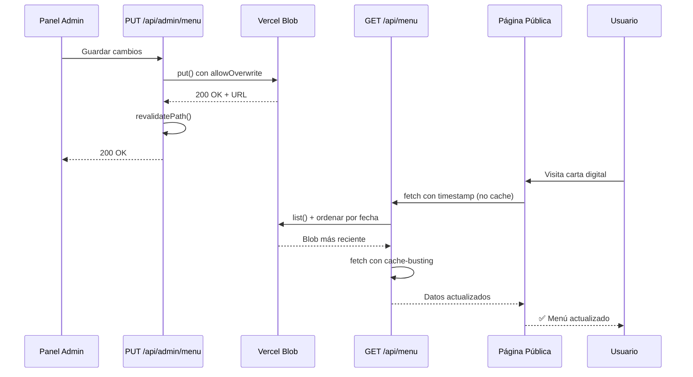

# Solución Completa: Sincronización Frontend-Backend con Vercel Blob

## Problema

Al actualizar el menú desde el panel de administración:

1. ✅ El PUT a `/api/admin/menu` devolvía 200 OK
2. ✅ El admin (GET `/api/admin/menu`) mostraba los cambios correctamente
3. ❌ **El frontend público (carta digital) seguía mostrando datos antiguos**

## Causas Raíz

### Backend

1. **`list()` sin ordenación**: No garantizaba devolver el blob más reciente
2. **Sin cache-busting**: URLs sin timestamp permitían cache del navegador
3. **Faltaba `allowOverwrite`**: Error al intentar guardar sobre blob existente

### Frontend

4. **Páginas estáticas cacheadas**: Next.js cacheaba las páginas como estáticas
5. **Fetch sin cache-busting**: `getMenuData()` no incluía timestamp

## Soluciones Implementadas

### 1. Backend: Ordenación Explícita por Fecha

**Archivo**: `app/api/admin/menu/route.ts`, `app/api/menu/route.ts`

```typescript
const { blobs } = await list({
  prefix: BLOB_FILENAME,
  limit: 10,
});

// Ordenar por fecha de subida descendente (más reciente primero)
const sortedBlobs = blobs.sort(
  (a, b) => new Date(b.uploadedAt).getTime() - new Date(a.uploadedAt).getTime(),
);

const blobUrl = sortedBlobs[0].url;
```

### 2. Backend: Cache-Busting en URLs

```typescript
const timestamp = Date.now();
const urlWithCacheBuster = `${blobUrl}?t=${timestamp}`;

const response = await fetch(urlWithCacheBuster, {
  cache: "no-store",
  headers: {
    "Cache-Control": "no-cache, no-store, must-revalidate",
    Pragma: "no-cache",
  },
});
```

### 3. Backend: Configuración PUT Correcta

```typescript
const blob = await put(BLOB_FILENAME, jsonString, {
  access: "public",
  addRandomSuffix: false,
  allowOverwrite: true, // ✅ Permite sobrescribir
  cacheControlMaxAge: 0, // No cachear en CDN
});
```

### 4. Frontend: Páginas Dinámicas

**Archivos modificados**:

- `app/[locale]/page.tsx`
- `app/[locale]/menu/page.tsx`
- `app/[locale]/menu/[category]/page.tsx`
- `app/[locale]/daily-menu/page.tsx`
- `app/[locale]/drinks/page.tsx`

```typescript
// Añadido al inicio de cada página después de imports
export const dynamic = "force-dynamic";
export const revalidate = 0;
```

Esto fuerza a Next.js a:

- ✅ Regenerar la página en cada request
- ✅ No usar caché estático
- ✅ Siempre obtener datos frescos

### 5. Frontend: Cache-Busting en getMenuData

**Archivo**: `lib/getMenuData.ts`

```typescript
const timestamp = Date.now();
const res = await fetch(`${baseUrl}/api/menu?t=${timestamp}`, {
  cache: "no-store",
  headers: {
    "Cache-Control": "no-cache, no-store, must-revalidate",
    Pragma: "no-cache",
  },
});
```

## Variables de Entorno Requeridas

En Vercel, asegúrate de tener configuradas:

```env
BLOB_READ_WRITE_TOKEN=vercel_blob_rw_...
NEXT_PUBLIC_BASE_URL=https://tu-dominio.vercel.app
ADMIN_TOKEN=tu-token-secreto
```

## Flujo Completo de Actualización



## Verificación Post-Despliegue

### 1. Verificar que el admin guarda correctamente

```bash
# En DevTools > Network > /api/admin/menu PUT
Status: 200 OK
Response: {
  "success": true,
  "blobUrl": "https://...",
  "timestamp": "2026-03-27T..."
}
```

### 2. Verificar que el GET admin lee correctamente

```bash
# En DevTools > Network > /api/admin/menu GET
Status: 200 OK
# Verificar que los datos tienen el cambio reciente
```

### 3. Verificar que el frontend público actualiza

```bash
# Abrir la carta digital en ventana de incógnito
# Hacer hard refresh (Ctrl+Shift+R)
# Verificar que aparecen los cambios
```

### 4. Revisar logs en Vercel

```
💾 Guardando en Vercel Blob...
✅ Blob guardado: https://...
📅 Timestamp: 2026-03-27T15:45:23.123Z
🔄 Rutas revalidadas

📥 API Pública - Leyendo blob más reciente: https://...
📅 Subido en: 2026-03-27T15:45:23.123Z
```

## Script de Diagnóstico

Si los problemas persisten:

```bash
# Ver estado de los blobs en Vercel
npx tsx scripts/blob-cleanup.ts

# Si hay múltiples versiones antiguas, limpiarlas
npx tsx scripts/blob-cleanup.ts --delete
```

## Archivos Modificados

### Backend

- `app/api/admin/menu/route.ts` - GET/PUT con ordenación y cache-busting
- `app/api/menu/route.ts` - GET público con la misma lógica
- `scripts/blob-cleanup.ts` - Script de diagnóstico (nuevo)

### Frontend

- `app/[locale]/page.tsx` - Añadido `dynamic` y `revalidate`
- `app/[locale]/menu/page.tsx` - Añadido `dynamic` y `revalidate`
- `app/[locale]/menu/[category]/page.tsx` - Añadido `dynamic` y `revalidate`
- `app/[locale]/daily-menu/page.tsx` - Añadido `dynamic` y `revalidate`
- `app/[locale]/drinks/page.tsx` - Añadido `dynamic` y `revalidate`
- `lib/getMenuData.ts` - Añadido cache-busting en fetch

## Problemas Conocidos y Soluciones

### Problema: "Blob already exists"

**Causa**: Falta `allowOverwrite: true`  
**Solución**: ✅ Ya implementado en el PUT

### Problema: Frontend muestra datos antiguos después de actualizar

**Causa**: Páginas cacheadas como estáticas  
**Solución**: ✅ `dynamic = 'force-dynamic'` implementado

### Problema: Admin ve cambios pero usuarios no

**Causa**: Cache del navegador o CDN  
**Solución**: ✅ Cache-busting con timestamps implementado

### Problema: Múltiples versiones del blob

**Causa**: `addRandomSuffix` era true en algún momento  
**Solución**: Ejecutar `npx tsx scripts/blob-cleanup.ts --delete`

## Performance

Con `dynamic = 'force-dynamic'`:

- ✅ Los cambios se reflejan inmediatamente
- ⚠️ Cada request regenera la página (más lento)
- 💡 Para mejorar: considerar ISR con `revalidate: 60` en el futuro

**Alternativa futura** (cuando sea estable):

```typescript
export const revalidate = 60; // Revalidar cada 60 segundos
// En lugar de:
export const dynamic = "force-dynamic";
```

Esto permitiría:

- Cache de 60 segundos para mejor performance
- Actualizaciones visibles en máximo 1 minuto
- Menos carga en Vercel Blob

## Conclusión

Con estos cambios, el flujo completo es:

1. Admin guarda → Blob actualizado con timestamp
2. Páginas públicas son dinámicas → No usan cache
3. Fetch incluye timestamp → Bypass de cache del navegador
4. GET ordena blobs por fecha → Siempre el más reciente

**Resultado**: Los cambios del admin se reflejan inmediatamente en el frontend público ✅
